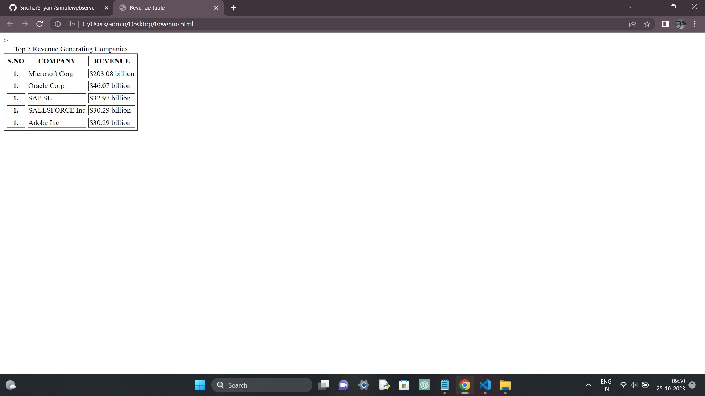
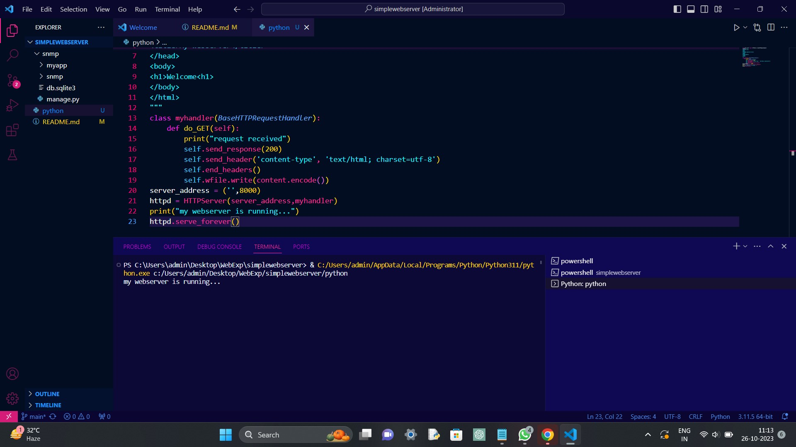

# EX01 Developing a Simple Webserver
## Date:06/10/2023

## AIM:
To develop a simple webserver to serve html pages.

## DESIGN STEPS:
### Step 1: 
HTML content creation.

### Step 2:
Design of webserver workflow.

### Step 3:
Implementation using Python code.

### Step 4:
Serving the HTML pages.

### Step 5:
Testing the webserver.

## PROGRAM:
```
<html>
	<title> Revenue Table </title>
	<body>
		<table border="2" cellspacing="5" cell padding="5">>
		<caption> Top 5 Revenue Generating Companies </caption>
		<tr>
			<th> S.NO </th>
			<th> COMPANY </th>
			<th> REVENUE </th>
		</tr>
		<tr>
			<th> 1. </th>
			<td> Microsoft Corp </td>
			<td> $203.08 billion </td>
		</tr>
		<tr>
			<th> 1. </th>
			<td> Oracle Corp </td>
			<td> $46.07 billion </td>
		</tr>
		<tr>
			<th> 1. </th>
			<td> SAP SE </td>
			<td>  $32.97 billion </td>
		</tr>
		<tr>
			<th> 1. </th>
			<td> SALESFORCE Inc </td>
			<td> $30.29 billion </td>
		</tr>
		<tr>
			<th> 1. </th>
			<td> Adobe Inc </td>
			<td> $17.61 billion </td>
		</tr>
		</table>
	</body>
</html>
```
## OUTPUT:


## RESULT:
The program for implementing simple webserver is executed successfully.